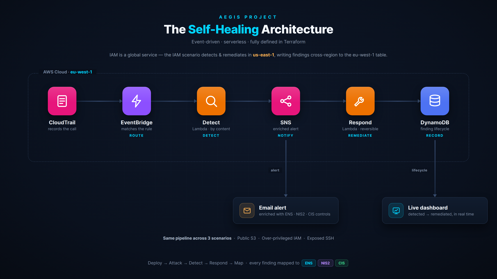

<div align="center">

# Aegis Project

### A self-healing cloud security range for AWS

**Attack, detect, auto-remediate, and map every finding to ENS, NIS2 & CIS.**

<sub>Deploy intentionally vulnerable AWS infrastructure, attack it, and watch it detect and remediate itself in seconds — with every finding tied to the Spanish ENS and EU NIS2 frameworks.</sub>

[]()
[]()
[]()
[]()
[]()
[]()

</div>

> [!WARNING]
> This project deploys **deliberately insecure** cloud resources. Run it only in an **isolated, dedicated AWS sandbox account**, and destroy the scenario infrastructure afterwards. Never deploy it in a production account. See [Safety & Cost](#safety--cost).

---

## Demo

▶️ **[Watch the 2-minute demo](https://youtu.be/ur0KWMKvw1Y)** — attack launched on the left, the live findings dashboard reacting on the right: detected in amber, auto-remediated in green, in ~3 seconds.

---

## What this is

Most "cloud security" portfolio projects are either a thin wrapper around an existing scanner, or a static *"I deployed a web app on AWS"* demo. Aegis takes a different angle: it reproduces the **full lifecycle of a real cloud security incident**, end to end, and does it automatically.

```
  ┌──────────┐   ┌──────────┐   ┌──────────┐   ┌──────────┐   ┌──────────┐
  │  DEPLOY  │─▶ │  ATTACK  │─▶ │  DETECT  │─▶ │ RESPOND  │─▶ │   MAP    │
  │ vuln IaC │   │ scripted │   │CloudTrail│   │  auto-   │   │ ENS/NIS2 │
  │Terraform │   │ exploit  │   │EventBridge│  │remediate │   │  /CIS    │
  └──────────┘   └──────────┘   └──────────┘   └──────────┘   └──────────┘
```

You don't just *talk* about misconfigurations — you deploy them, exploit them, catch them, fix them automatically, and prove which compliance controls each one violated.

I'm a Computer Engineering student learning cloud security, and I built this to understand — hands on — how the mechanisms inside cloud security platforms actually work, rather than only clicking through a managed tool.

## The differentiator: compliance as context

Every detection is enriched with the specific control it violates in three frameworks:

- **ENS** — *Esquema Nacional de Seguridad* (Royal Decree 311/2022), Spain's national security framework for the public sector.
- **NIS2** — the EU directive on network and information security.
- **CIS AWS Foundations Benchmark v3.0.0** — the international baseline.

So instead of a bare *"SSH is open to the world"*, Aegis produces an enriched, actionable finding:

> **[HIGH] SSH exposed to the internet detected** — `sg-042edcd9004be3be5`
> MITRE ATT&CK: T1133 · Actor: `…:user/aegis-lab-admin`
> Violates **ENS** `mp.com.1, op.exp.2, op.exp.8, op.mon.1` · **NIS2** `Art. 21(2)(i,e,b)` · **CIS AWS** `5.2, 5.3`
> Response: automatic remediation dispatched — offending rule revoked.

That mapping to ENS is rarely seen in a public portfolio project. For Spanish employers and any organisation handling EU public-sector data, it signals an understanding of the regulatory reality they actually operate in.

## How it works



When a dangerous change happens, CloudTrail records it. An EventBridge rule triggers a **detection Lambda** that identifies the threat **by its content, not by who caused it**. The finding is enriched with its compliance controls, an alert goes out over SNS, its lifecycle is recorded in DynamoDB, and a second **remediation Lambda** fixes the issue — **surgically and reversibly**. The whole cycle runs in seconds and is fully serverless, defined entirely in Terraform.

| Layer | What it does | Key AWS services |
|-------|--------------|------------------|
| **Core** | Shared logging, alerting & persistence backbone | CloudTrail, SNS, S3, DynamoDB |
| **Scenarios** | Self-contained vulnerable setups | S3, IAM, EC2, VPC / Security Groups |
| **Detection** | Match risky events to rules, by content | EventBridge → Lambda |
| **Remediation** | Auto-fix the misconfiguration, reversibly | Lambda + boto3 |
| **Engine** | Compliance mapping, enrichment, notification, persistence | Python (boto3), tested with pytest |
| **Dashboards** | Live findings feed + compliance coverage | Streamlit + Altair |

Each scenario is fully modular and follows the same internal pattern, so the range grows by adding a folder.

### A note on regions

Most resources live in `eu-west-1`. **IAM is a global service**, so its CloudTrail events are only delivered to EventBridge in `us-east-1` — which means the IAM scenario's detection and remediation run there, while still writing findings **cross-region** back to the DynamoDB table in `eu-west-1`. Handling that quirk correctly was one of the more instructive parts of the build.

## Scenario catalogue

All three scenarios are **fully implemented and verified against real AWS** — deploy → attack → detect → respond → map, each committed with its own README and verified `mapping.yaml`.

| # | Scenario | Technique (MITRE ATT&CK) | Remediation | Region |
|---|----------|--------------------------|-------------|--------|
| 01 | Public S3 bucket | T1530 — Data from Cloud Storage | Restore public-access block / bucket policy | `eu-west-1` |
| 02 | Over-privileged IAM | T1078 — Valid Accounts | Attach reversible quarantine deny policy | `us-east-1` |
| 03 | Exposed SSH (`0.0.0.0/0`) | T1133 — External Remote Services | Revoke only the offending SG rule | `eu-west-1` |

Remediation is deliberately **surgical and reversible**: the IAM scenario never detaches the original policy (it layers a quarantine deny on top), and the SSH scenario revokes only the specific offending rule rather than wiping the security group.

## Repository layout

```
aegis-project/
├── infra/core/             # shared backbone: CloudTrail, SNS, S3, DynamoDB
├── scenarios/              # one folder per attack scenario (the heart of the range)
│   ├── 01-public-s3-bucket/
│   │   ├── infra/          #   Terraform: the vulnerable resource
│   │   ├── attack/         #   Python: reproduce the exploit
│   │   ├── detection/      #   EventBridge rule + detection Lambda
│   │   ├── remediation/    #   Lambda that fixes it, reversibly
│   │   ├── mapping.yaml    #   ENS / NIS2 / CIS mapping for this scenario
│   │   └── README.md       #   the scenario's story
│   ├── 02-overprivileged-iam/
│   └── 03-exposed-ssh/
├── engine/                 # shared Python: mapping, notifier, findings store
│   └── store/              #   DynamoDB persistence for the finding lifecycle
├── dashboard/              # Streamlit: live findings + compliance coverage
├── scripts/                # deploy / destroy / run-attack helpers
├── tests/                  # pytest suite for the engine
└── docs/                   # architecture & compliance notes
```

## The engine & persistence

The `engine/` package is the shared brain, with a small tested core:

- **Mapper** — turns a raw detection into an enriched finding with its ENS / NIS2 / CIS controls, severity and MITRE technique, driven by each scenario's `mapping.yaml`.
- **Notifier** — formats and sends the enriched alert over SNS.
- **Findings store** (`engine/store/`) — records the lifecycle in DynamoDB: `record_detection()` writes the finding as `detected`; `record_remediation()` flips it to `remediated`. This is what gives the live dashboard a real-time, region-aware view — including the cross-region writes from the IAM scenario.

The engine is covered by a **pytest suite** (using `moto` to mock AWS), so the mapping and persistence logic is verified without touching a real account.

## Dashboards

A multipage Streamlit app (`dashboard/`):

- **Live Findings** — reads DynamoDB in real time, showing each finding move from **detected** (amber) to **remediated** (green), with a time-to-remediate metric and the compliance controls for each. This is the centrepiece of the demo.
- **Coverage** — reads every scenario's `mapping.yaml` and visualises how many ENS / NIS2 / CIS controls the range exercises, with an Altair breakdown per framework.

## Quickstart

> **Prerequisites:** an **isolated AWS sandbox account**, [Terraform](https://terraform.io) ≥ 1.7, Python ≥ 3.12, AWS CLI configured. On Windows, the scripts run under Git Bash.

```bash
git clone https://github.com/eloirey/aegis-project.git
cd aegis-project
python -m venv .venv && source .venv/Scripts/activate   # Linux/macOS: source .venv/bin/activate
pip install -r requirements.txt

# 1. Deploy the shared backbone (CloudTrail, SNS, S3, DynamoDB)
./scripts/deploy.sh core

# 2. Deploy a scenario end to end (vulnerable infra + detection + remediation)
./scripts/deploy.sh 03-exposed-ssh

# 3. Launch the attack — it resolves targets from Terraform outputs automatically
./scripts/run-attack.sh 03-exposed-ssh

# 4. (optional) watch it live
streamlit run dashboard/app.py

# 5. Tear the scenario down (important for cost & safety!)
./scripts/destroy.sh 03-exposed-ssh
```

The core backbone (CloudTrail, SNS, S3 logs, an on-demand DynamoDB table) is designed to stay up at effectively zero cost; only the scenario infrastructure needs to be destroyed after each session.

## Safety & cost

- **Run only in a dedicated sandbox AWS account.** Never in production.
- Scenarios are designed to fit inside the **AWS Free Tier**; the only resource with a real hourly cost is the EC2 instance in the SSH scenario — always `destroy` when done.
- Set up an **AWS Budget alert** before you start.
- The vulnerable resources are intentionally insecure — treat the whole account as untrusted while the lab is up.
- The `alert_email` is kept out of version control in a gitignored `.tfvars` file.

## Tech stack

`Terraform` · `AWS (CloudTrail, EventBridge, Lambda, SNS, IAM, S3, EC2, DynamoDB)` · `Python 3.12` · `boto3` · `pytest` + `moto` · `Checkov / tfsec` · `GitHub Actions` · `Streamlit` · `Altair`

**Compliance frameworks:** ENS (RD 311/2022) · NIS2 (Art. 21) · CIS AWS Foundations Benchmark v3.0.0

## Roadmap

Aegis is published with three complete, verified scenarios. It's an ongoing learning project, and the natural next steps are:

1. More scenarios covering additional ENS / NIS2 controls (the pattern is designed to extend by adding a folder).
2. A blue-team companion project — threat hunting / a mini-SIEM operating *over* this infrastructure.
3. Deeper resilience: dead-letter queues and retries on the detection path.

## Author

**Eloi Rey** — Computer Engineering student, focused on cloud security & compliance.
[LinkedIn](https://www.linkedin.com/in/eloi-rey/) · [GitHub](https://github.com/eloirey) · [Portfolio](https://eloirey.github.io)

---

<div align="center">
<sub>Aegis (Greek mythology): the shield of Zeus and Athena — a symbol of protection.</sub>
</div>
