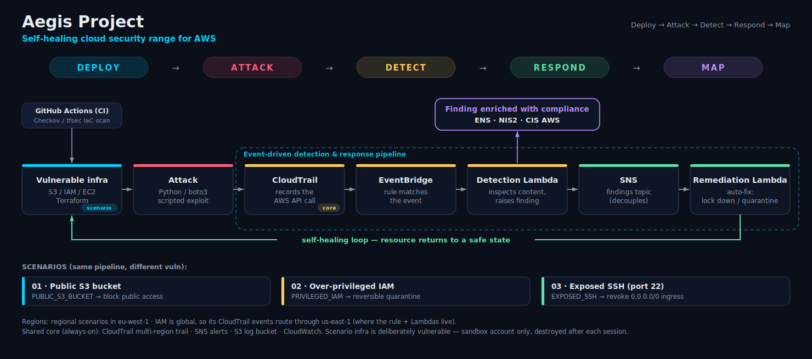

#Architecture

Aegis Project is built around a single repeatable loop. Every scenario plugs into the same
shared backbone, so adding a new attack means adding a folder — not rewriting anything.

## The detection loop

1. **Deploy** — Terraform stands up a deliberately vulnerable resource (the scenario infra).
2. **Attack** — a Python/boto3 script reproduces the exploit safely, making a real AWS API call.
3. **Detect** — CloudTrail records the call; an EventBridge rule matches it and invokes the
   detection Lambda, which inspects the event and raises a structured **finding**.
4. **Respond** — the finding is published to SNS; the remediation Lambda is subscribed and
   auto-fixes the resource (e.g. block public access, quarantine the identity, revoke ingress).
5. **Map** — every finding is tied to the **ENS / NIS2 / CIS** controls it violates (today via
   each scenario's `mapping.yaml`; runtime enrichment is the planned next step — see *Engine*).

Detection and remediation are **decoupled through SNS** so a single finding can fan out to
several responders.

## Components

### Core (`infra/core`) — built
The shared, always-on backbone every scenario depends on:
- **CloudTrail** — multi-region trail that records every API call in the account. Source of truth.
- **EventBridge** — the default event bus carries CloudTrail events; each scenario adds its own rule.
- **SNS** — `aegis-project-alerts` is the central human-alerting channel.
- **Log bucket + CloudWatch** — log storage and Lambda observability.

### Scenario (`scenarios/NN-name/`) — 01 & 02 built, 03 planned
A self-contained unit with five parts that always follow the same shape:
- `infra/` — Terraform that creates the **vulnerable** resource.
- `attack/` — a Python script that **reproduces the exploit** safely.
- `detection/` — the EventBridge rule + Lambda that **catches** it, plus the per-scenario
  `aegis-project-findings` SNS topic the finding is published to.
- `remediation/` — the Lambda (subscribed to that topic) that **fixes** it.
- `mapping.yaml` — the ENS / NIS2 / CIS controls this scenario relates to.

> **Region note:** regional scenarios live in `eu-west-1`. IAM is global, so its CloudTrail
> events are delivered to EventBridge in `us-east-1` — scenario 02's rule and Lambdas run there.

### Engine (`engine/`) — scaffolded, not yet wired in
A shared Python package intended to remove boilerplate from the Lambdas. **Today it is a
skeleton (`NotImplementedError` stubs); the detection and remediation Lambdas are currently
self-contained and do not import it.** Implementing it is the project's next milestone:
- `mapping/` — load each scenario's `mapping.yaml` and **enrich a finding with its controls
  at runtime**, turning a raw event into compliance-aware context (the signature feature).
- `notifier/` — format an enriched finding into a readable alert and publish it.
- `detection/`, `remediation/` — shared helpers so scenarios stop repeating logic.

Until the engine lands, the compliance mapping is documentation-level (the `mapping.yaml`
files), not part of the live alert payload.

## Design principles
1. **Reproducible** — everything is Terraform; `apply` to build, `destroy` to remove.
2. **Modular** — scenarios are independent; the range grows by addition, not rewriting.
3. **Observable** — every step (attack, detect, remediate) leaves a visible trace.
4. **Compliance-aware** — findings map to their controls; runtime enrichment is the goal.
5. **Cheap & safe** — Free Tier friendly, sandbox-only, always tear-down-able.

## Key technical decisions (the "why" — interviewers love these)
- **Why EventBridge over polling?** Event-driven detection is near real-time and cheaper.
- **Why Lambda for remediation?** Serverless = no infra to babysit, scales to zero.
- **Why CloudTrail as the source?** It's the authoritative record of every API action.
- **Why SNS between detect and respond?** Decoupling lets one finding fan out to multiple
  responders (and later: email, Slack, a dashboard) without touching the detector.
- **Why a mapping layer?** It turns raw security events into business/compliance language —
  the differentiator. Wiring it into the runtime (the `engine/`) is the planned next step.